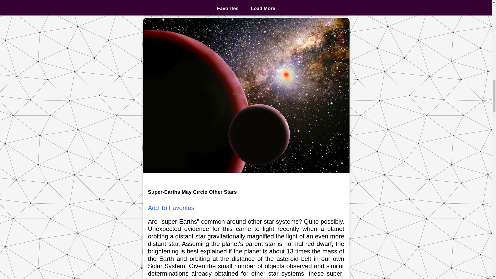

<h1 align="center" id="top">NASA API Pictures</h1>

<h1 align="center"><a href="https://jonnathanriquelmo.github.io/nasa-api-apod/"><strong>📺 LIVE DEMO</strong></a></h3>

<h2 id="table-of-contents"> 📖 Table of Contents</h2>

  

    
Table of Contents

    <ol>
      <li><a href="#about-the-project">About The Project</a></li>
      <li><a href="#technologies">Technologies</a></li>
      <li><a href="#prerequisites">Prerequisites</a></li>
      <li><a href="#installation">Installation</a></li>
      <li><a href="#author">Author</a></li>
    </ol>
  

<!-- ABOUT THE PROJECT -->
<h2 id="about-the-project"> :pencil: About The Project</h2>

A web page that incorporates a NASA API to get random astronomy pictures of the day formatted on cards. The user can even bookmark favorites, which are saved with the help of <a href="https://developer.mozilla.org/en-US/docs/Web/API/Window/localStorage" target="_blank">Window.localStorage</a>. Based on a <a href="https://zerotomastery.io/" target="_blank">ZTM</a> JavaScript course.

<!-- technologies -->
<h2 id="technologies"> 🛠 Technologies</h2>

The following technologies were used to build the project:

- HTML5
- CSS3
- JavaScript
- [Astronomy Picture of the Day (APOD) API](https://github.com/nasa/apod-api/)

<!-- prerequisites -->
<h2 id="prerequisites"> ✔️ Prerequisites</h2>

If you want to install the project, you need to have the following requirements:

- [Git](https://git-scm.com/)
- A code editor <i>e.g.</i> [VSCode](https://code.visualstudio.com/)

<!-- installation -->
<h2 id="installation"> 🖥️ Installation</h2>

Clone the repo in the terminal, or command line in your code editor

<pre><code>git clone https://github.com/JonnathanRiquelmo/nasa-api-apod.git </code></pre>

<!-- author -->
<h2 id="author"> 📜 Author</h2>

Jonnathan Riquelmo

[⬆ Back to Top](#top) 